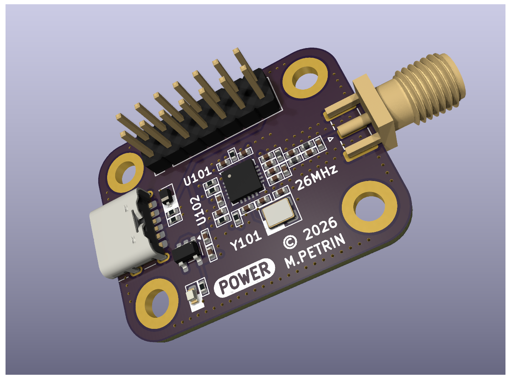
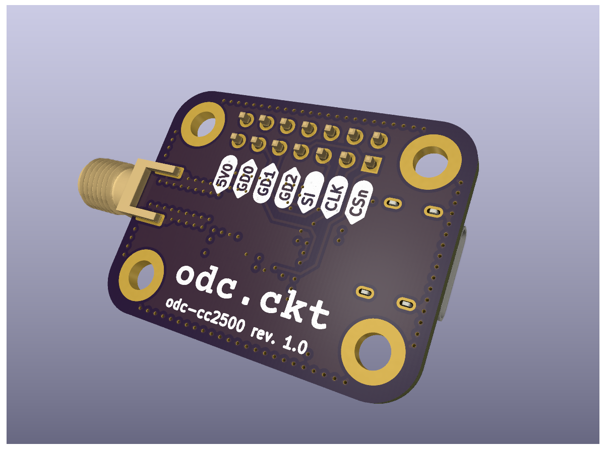

Copyright © 2026 Matthew Petrin

Liscenses are annoying. Please feel free to use this design for any personal projects. Please do not sell any products using this design without my express permission. And of course, follow any local RF regulations.

---
<kbd> 
	 
</kbd>

---
<kbd> 
	 
</kbd>

## About:
This repo contains KiCAD files and fabrication outputs for a simple breakout board designed around the CC2500 transceiver. The board features a 0.1" pitch header providing access to the IC's control pins, and an SMA header on the RF output.

The board is to be powered by a 5V DC source, which is regulated down to 3.3V. Power can be provided via the rectangular header, or via USB C.

The project is designed in KiCAD 9, and should be compatible with equal or greater versions. All required symbols and footprints are contained within.

## Part Selection:
A BOM is provided in the repo. There are a few components which may be affected by manufacturing processes:

The choice of termination capacitors around the crystal resonator will depend on board parasitics - see the CC2500 datasheet for further details

The choice of current-limiting resistor on the power LED will obviously depend on the forward voltage of the selected LED and the desired brightness.

The series termination resistors on the CC2500 may need to be adjusted/shorted depending on bus impedance, bus length, edge rate, and external capacitance.

## Directories:
`assets`: Images associated with documentation.

`docs`: Currently empty. May be updated in the future.

`fab`: Files required for board fabrication and assembly (bill-of-materials, gerbers, schematics, and position files).

`kicad`: KiCAD project files, including schematic, layout, symbols, footprints, and design rules.

## Other Notes:
Board mounting holes are compatible with m3 or 4-40 screws, and are spaced 26x18 mm.

As of rev. 1.0, the mounting holes are not grounded.

## Datasheets:
[CC2500](https://www.ti.com/lit/ds/symlink/cc2500.pdf?ts=1783648273403&)

